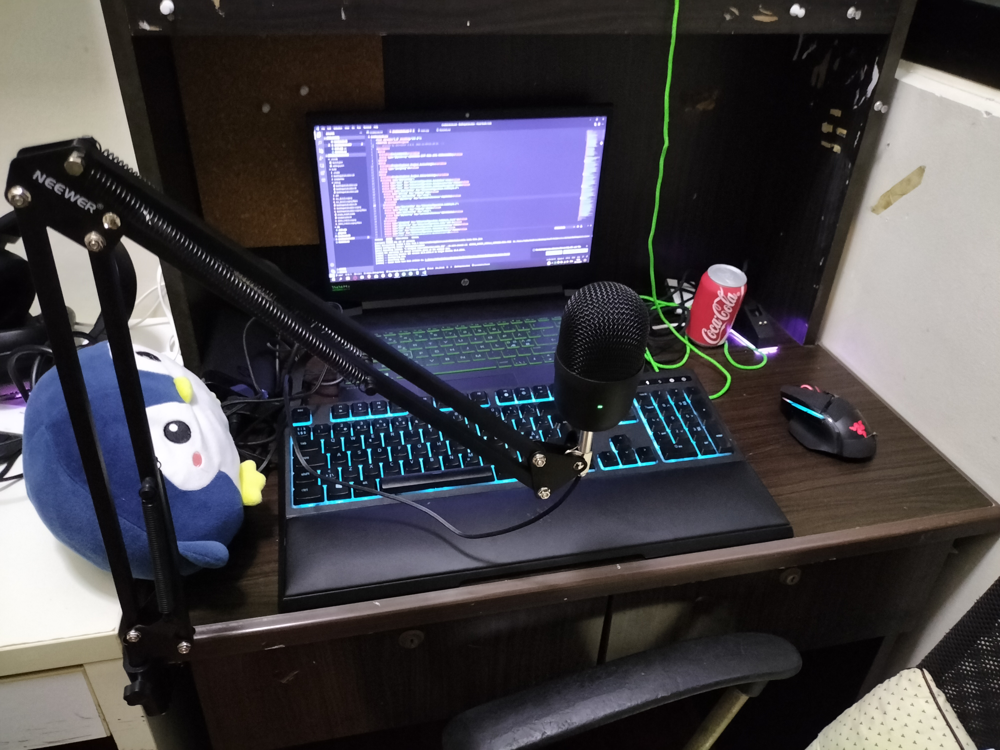

# VeryHolyCheeseee
## **Creating fun since 2020!**

## **Personal Information**
**Nationality:** Finnish\
**Current Location:** Singapore\
**Timezone:** GMT+8
## **Social Media**
[Discord](https://discord.gg/D58eTkhMR9) (I always respond and alarmingly fast)\
**Discord Username:** DarkCheese_#3655\
[Twitch](https://www.twitch.tv/darkcheese_) (I don't stream)\
[Youtube](https://www.youtube.com/channel/UCEEnMHYn_el3tplzVLkgTog) (I sometimes upload)\
[MyWebsite](https://cheese-is-cool.tech) (my cool website)
## **Creations**
### **Cheese-is-cool.tech**
My website.\
i stg it doesn't have a ip grabber. \
But it does have my cool neofetch.
### **VaccineSpoof**
As it sounds like i made a application that pretty much is a spoof of every vaccine tracker.
### **TicTacToeButCheesy**
Its Tic Tac Toe but the computer works every time.
### **BadShapeCalculator**
Someone requested i make a shape calculator for children, It is to calculate parameter and area. \
Its never too early for children to learn how to download Visual Studio code, Cmake, and how to compile and run a c++ project.
### **DarkH overlay (No longer worked on)**
DarkH overlay is a Resourcepack that changes the appearance of certain aspects of a Minecraft server called Hypixel.
### **Interactive Stream (No longer worked on)**
Interactive stream is currently in its VERY early stages\
The Interactive Stream is a stream currently being worked on using Unreal Engine 5.\
In the interactive stream, viewers are able to use channel points and chat to interact with the stream.\
VeryHolyCheeeese is part of Team Interactive.
### **AutoBoop (exists for god knows why.)**
Autoboop Is a minecraft modification that runs the command /boop [Friend's name] when a [Friend] logins to the minecraft server Minecraft.

## **Development Setup**
A clearer picture can be requested in the discord.\

## **Peripherals**
**Keyboard:** Razer ornata chroma \
**Mouse:** Razer basilisk ultimate \
**Headset:** Razer blackshark v2 special edition \
**Microphone:** Razer Seiren mini \
**Computer:** Hp pavilion. (More information can be requested go to discord.)

## **Neofetch**
<pre><b>         -/oyddmdhs+:.</b>                <b>cheese</b>@<b>compuuter</b> 
<b>     -o</b><b>dNMMMMMMMMNNmhy+</b><b>-`</b>             ---------------- 
<b>   -y</b><b>NMMMMMMMMMMMNNNmmdhy</b><b>+-</b>           <b>OS</b>: Gentoo/Linux x86_64 
<b> `o</b><b>mMMMMMMMMMMMMNmdmmmmddhhy</b><b>/`</b>        <b>Host</b>: HP Pavilion Gaming Laptop 15-ec0xxx 
<b> om</b><b>MMMMMMMMMMMN</b><b>hhyyyo</b><b>hmdddhhhd</b><b>o`</b>      <b>Kernel</b>: 5.15.11-gentoo-x86_64 
<b>.y</b><b>dMMMMMMMMMMd</b><b>hs++so/s</b><b>mdddhhhhdm</b><b>+`</b>    <b>Uptime</b>: ALOT
<b> oy</b><b>hdmNMMMMMMMN</b><b>dyooy</b><b>dmddddhhhhyhN</b><b>d.</b>   <b>Packages</b>: 1032 (emerge) 
<b>  :o</b><b>yhhdNNMMMMMMMNNNmmdddhhhhhyym</b><b>Mh</b>   <b>Shell</b>: bash 5.1.8 
<b>    .:</b><b>+sydNMMMMMNNNmmmdddhhhhhhmM</b><b>my</b>   <b>Resolution</b>: 1920x1080 
<b>       /m</b><b>MMMMMMNNNmmmdddhhhhhmMNh</b><b>s:</b>   <b>DE</b>: GNOME 40.4 
<b>    `o</b><b>NMMMMMMMNNNmmmddddhhdmMNhs</b><b>+`</b>    <b>WM</b>: Mutter 
<b>  `s</b><b>NMMMMMMMMNNNmmmdddddmNMmhs</b><b>/.</b>      <b>WM Theme</b>: Adwaita 
<b> /N</b><b>MMMMMMMMNNNNmmmdddmNMNdso</b><b>:`</b>        <b>Theme</b>: Adwaita-dark [GTK2/3] 
<b>+M</b><b>MMMMMMNNNNNmmmmdmNMNdso</b><b>/-</b>           <b>Icons</b>: Adwaita [GTK2/3] 
<b>yM</b><b>MNNNNNNNmmmmmNNMmhs+/</b><b>-`</b>             <b>Terminal</b>: gnome-terminal 
<b>/h</b><b>MMNNNNNNNNMNdhs++/</b><b>-`</b>                <b>CPU</b>: AMD Ryzen 7 3750H with Radeon Vega M 
<b>`/</b><b>ohdmmddhys+++/:</b><b>.`</b>                   <b>GPU</b>: AMD ATI 05:00.0 Picasso 
<b>  `-//////:--.</b>                        <b>GPU</b>: NVIDIA GeForce GTX 1660 Ti Mobile 
                                      <b>Memory</b>: 3194MiB / 13925MiB 
</pre>

## **FaQ**
**Q:** Why do you exist?\
**A:** Because i do.\
\
**Q:** Why are you so active on discord?\
**A:** There is no actual reasoning to this but i have discord open at all times in case anyone desperately needs me.\
\
**Q:** Can i contact you using email?\
**A:** Why yes i have a business email darkcheesebusiness@gmail.com\
\
**Q:** Can i send you unwanted advertisements to your direct messages in discord?\
**A:** If you decide to send me unwanted advertisements in my direct messages on discord i will be reporting you to Trust and Safety.\
\
**Q:** REEE?\
**A:** REEE

