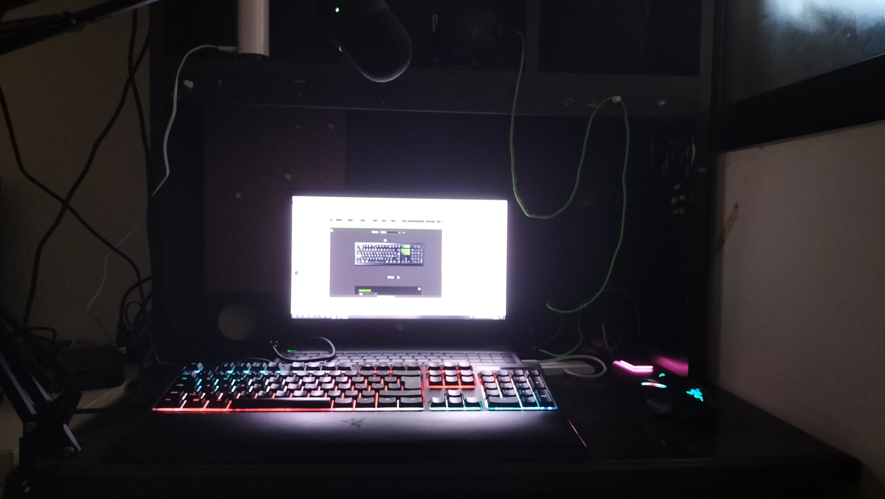

# VeryHolyCheeseee
## **Creating fun since 2020!**

## **Personal Information**
**Nationality:** Finnish\
**Current Location:** Singapore\
**Timezone:** GMT+8
## **Social Media**
[Discord](https://discord.gg/D58eTkhMR9) (I always respond and alarmingly fast)\
**Discord Username:** DarkCheese_#3655\
[Twitch](https://www.twitch.tv/darkcheese_) (I stream alot, Notification is going to be on discord when i stream)\
[Youtube](https://www.youtube.com/channel/UCEEnMHYn_el3tplzVLkgTog) (I sometimes upload)\
[MyWebsite](https://cheese-is-cool.tech) (my cool website)
## **Creations**
### **Cheese-is-cool.tech**
My website.\
i stg it doesn't have a ip grabber. \
But it does have my cool neofetch.
### **Susmod**
Im developing susmod for minecraft 1.19 along with other developers
### **BadShapeCalculator**
Someone requested i make a shape calculator for children, It is to calculate parameter and area. \
Its never too early for children to learn how to download Visual Studio code, Cmake, and how to compile and run a c++ project.
### **DarkH overlay (No longer worked on)**
DarkH overlay is a Resourcepack that changes the appearance of certain aspects of a Minecraft server called Hypixel.
### **Interactive Stream (No longer worked on)**
Interactive stream is currently in its VERY early stages\
The Interactive Stream is a stream currently being worked on using Unreal Engine 5.\
In the interactive stream, viewers are able to use channel points and chat to interact with the stream.\
VeryHolyCheeeese is part of Team Interactive.
### **AutoBoop (exists for god knows why.)**
Autoboop Is a minecraft modification that runs the command /boop [Friend's name] when a [Friend] logins to the minecraft server Minecraft.

## **Development Setup**
A clearer picture can be requested in the discord.\

Yes that is a signal extender right next to my computer (this managed to negate ALL packet loss i was experiencing before i moved it here.)\
## **Peripherals**
**Keyboard:** Razer ornata chroma \
**Mouse:** Razer basilisk ultimate \
**Headset:** Razer blackshark v2 special edition \
**Microphone:** Razer Seiren mini \
**Computer:** Hp pavilion. (More information can be requested go to discord.)

## **FaQ**
**Q:** Why do you exist?\
**A:** Because i do.\
\
**Q:** Why are you so active on discord?\
**A:** There is no actual reasoning to this but i have discord open at all times in case anyone desperately needs me.\
\
**Q:** Can i contact you using email?\
**A:** Why yes i have a business email darkcheesebusiness@gmail.com\
\
**Q:** Can i send you unwanted advertisements to your direct messages in discord?\
**A:** If you decide to send me unwanted advertisements in my direct messages on discord i will be reporting you to Trust and Safety.\
\
**Q:** REEE?\
**A:** REEE

